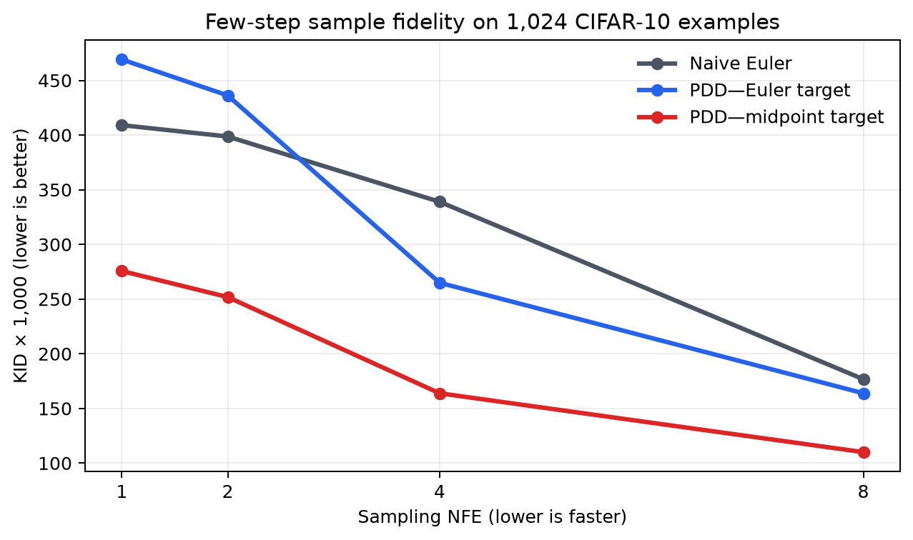
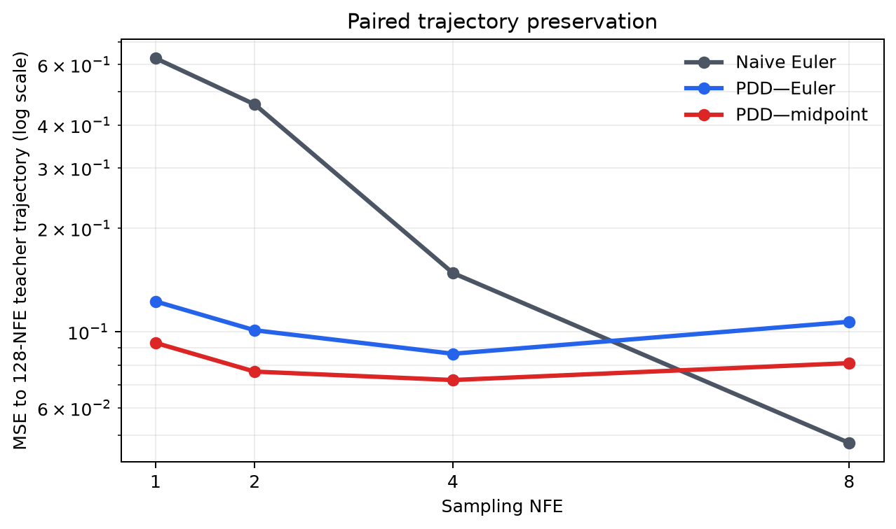
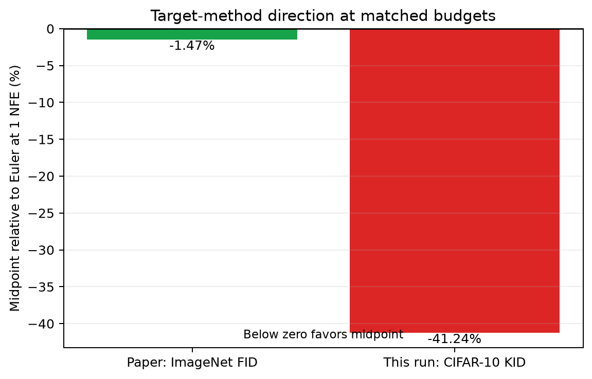
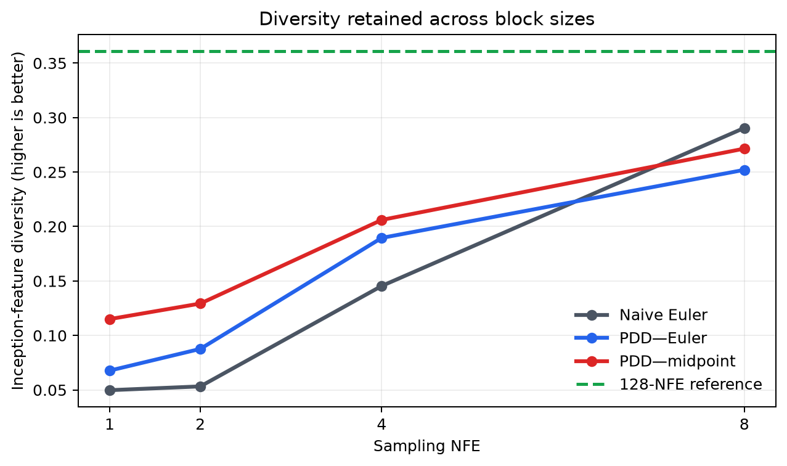
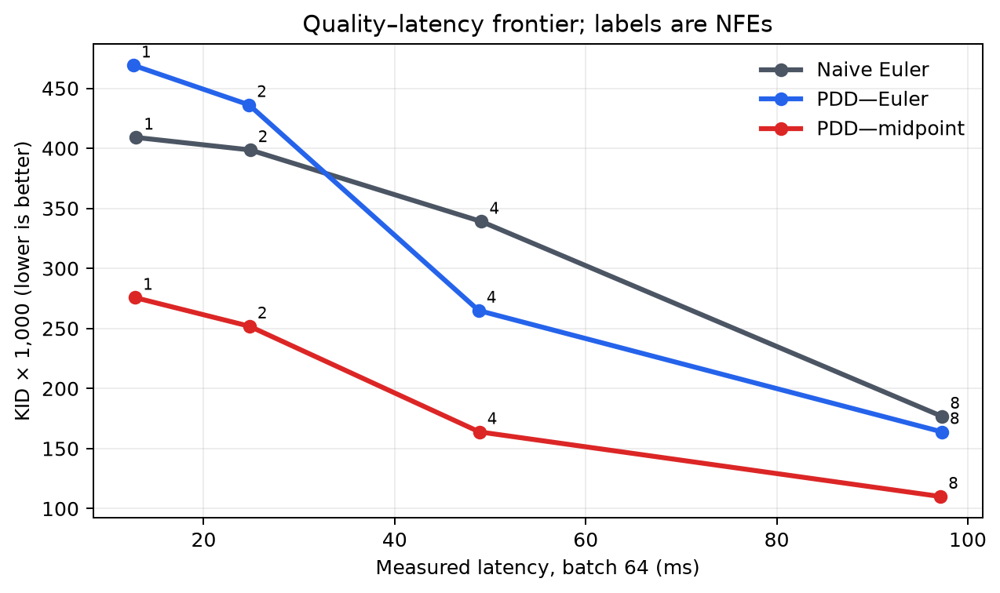

# Reconstructing Parallel Decoding Distillation on CIFAR-10

Diffusion image generators normally refine noise through many sequential network calls, which makes high-quality sampling slow. Parallel Decoding Distillation (PDD) asks one call to predict several future updates at once, and this reproduction tests whether that shortcut improves a compact public image generator at very low evaluation counts. We reconstructed the training and fused inference path from the paper rather than using author code.

**Verdict — partially reproduced.** With enough training, the midpoint PDD reconstruction beat a matched naive large-step solver, midpoint targets beat Euler targets, and one model improved across 1, 2, 4, and 8 evaluations. The verdict is partial because this is a CIFAR-10 algorithmic substitution, not the paper's large ImageNet or video setting.

**Scope.** We used `google/ddpm-cifar10-32`, 1,024 fixed noise seeds, public UofT CIFAR-10 images, and a 128-NFE midpoint teacher reference. The selected compact model has eight interval heads and trained for 80,000 updates; paper-length and EMA checks are supporting diagnostics.

Lower curves are better. The midpoint PDD model is already better than naive Euler at one evaluation and improves steadily as it receives more evaluations. Euler-target PDD needs four evaluations before it beats the naive control, making the target construction decisive.

## From equations to executable code

The teacher is a pretrained epsilon-predicting U-Net, interpreted as a continuous variance-preserving probability flow. We copied its network and repeated the final convolution into one output head per fixed time interval. Each update sampled a noisy CIFAR-10 image and starting grid point, rolled forward with detached student outputs, then regressed one selected head onto a stop-gradient teacher velocity.

The target was either one Euler evaluation or a midpoint update using two evaluations. Euler accumulated two independently sampled targets per update, matching midpoint's teacher-call budget. At inference, the weights and biases of heads inside a block were summed into one final convolution. The fused layer agreed with the explicit head sum within 0.00049 maximum absolute error in bfloat16.

## Claim-by-claim evidence

### 1. PDD improves few-evaluation fidelity

At 1 NFE, midpoint PDD reduced KID × 1,000 from **409.06** for naive Euler to **275.67**. Paired trajectory MSE to the fine teacher dropped from **0.6265** to **0.0928**. KID is noisy with 1,024 images, but the large paired-error change makes the direction unambiguous.

At 8 NFE, PDD retained better KID (**110.03** versus **176.71**) while naive Euler had lower endpoint MSE (**0.0474** versus **0.0810**). This difference is informative: PDD's samples match real-image features better, but the coarse numerical solver more closely follows the chosen fine teacher trajectory at the largest tested budget.

### 2. Midpoint targets outperform Euler

The paper reports 1-NFE ImageNet FID of 2.69 for midpoint targets versus 2.73 for Euler. In the matched grid-8 reconstruction, midpoint reduced 1-NFE KID from **469.12** to **275.67** and trajectory MSE from **0.1226** to **0.0928**. Midpoint was better at every tested NFE.

The figure compares relative direction, not metric scale: below zero favors midpoint. Both the paper and this reconstruction point in the same direction, with a much larger effect in the compact model.

### 3. One model spans several block sizes

The same midpoint checkpoint used block sizes 8, 4, 2, and 1 to produce 1, 2, 4, and 8 NFE samples. KID improved monotonically from **275.67** to **110.03**, while feature diversity rose from **0.115** to **0.271** toward the fine reference's **0.361**. No retraining or runtime head selection was needed.

Latency scaled from about 13 ms at 1 NFE to 97 ms at 8 NFE for a batch of 64. PDD and naive sampling cost essentially the same per evaluation; the gain is a better quality frontier, not hidden extra computation.

## Robustness and diagnostics

Training duration was the main boundary condition. Eight independent 8,000-update runs per target were uniformly poor; at 80,000 updates, two grid-16 seeds agreed closely and the smaller grid-8 model improved further. Reducing the learning rate from `5e-5` to `1e-5` or `1e-6` caused reproducible underfitting. Freezing the entire U-Net trunk changed no measured sample value for either target, showing that the repeated output heads carried the gain in this setup.

| Claim | Paper evidence | Observed here | Assessment |
|---|---|---|---|
| PDD beats naive few-step sampling | Strong large-model FID/quality | 1-NFE KID 275.67 vs 409.06; MSE 0.0928 vs 0.6265 | Aligned |
| Midpoint beats Euler | 2.69 vs 2.73 ImageNet FID | 275.67 vs 469.12 KID × 1,000 | Aligned |
| One model spans block sizes | Improving quality over 1/2/4/8 NFE | KID 275.67 → 110.03; diversity 0.115 → 0.271 | Aligned |

No author code or checkpoint is available, and this compact teacher cannot validate 14B–22B video/audio quality. A full reproduction still needs the paper's SiT-XL/ImageNet setup, training scale, and media benchmarks. All formal runs used OpenResearch **Kubernetes** on **NVIDIA RTX PRO 6000 Blackwell** GPUs, peaking at **16 concurrent GPUs**; measured elapsed wall time is recorded in `autoresearch.json`.
